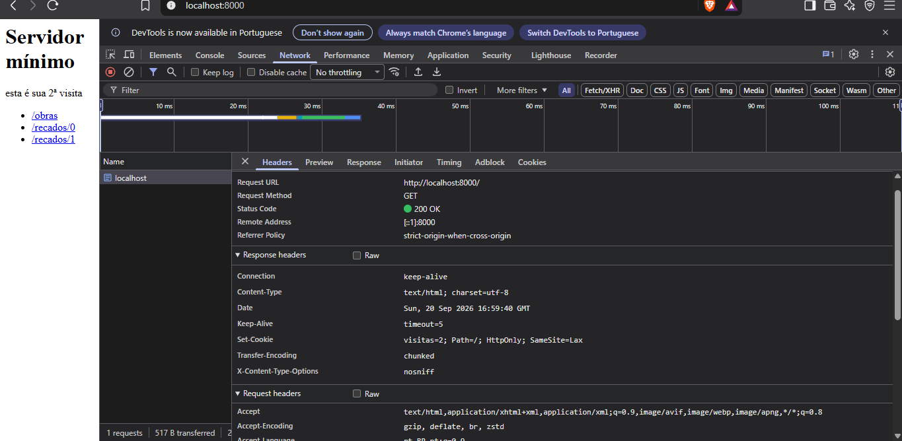

# E0 — Relatório de inspeção HTTP

> **Aluno:** Joseildo Ixel  
> **Projeto:** EcoCampusIFPE  
> **Módulo:** M01 — Fundamentos da Web e HTTP

---

## 1. Prática 1 — inspeção no DevTools

### Procedimento

1. Abrir o DevTools com `F12` e selecionar **Network**.
2. Marcar **Preserve log** e, durante a coleta, **Disable cache**.
3. Acessar uma página de teste que não exponha dados sensíveis.
4. Recarregar a página e observar os filtros **Doc**, **Fetch/XHR** e **Img**.
5. Selecionar a requisição principal e registrar os dados abaixo.

### Tabela de observação

| Item | Observação registrada |
|---|---|
| Total de requisições da primeira página | **1 requisição** (site testado: `http://localhost:8000/`). |
| Método e status do documento | `GET` e `200 OK`, confirmado na requisição `document`. |
| `Content-Type` da resposta principal | `text/html; charset=utf-8`, confirmado em **Headers → Response headers**. |
| Requisição que enviaria um descarte | `POST /api/descartes`, com JSON ou `multipart/form-data`. |
| Cabeçalho de autenticação da área da CINFRA | `Authorization: Bearer ...` ou `Cookie: sessionid=...`, conforme a aplicação. |
| Cache ou resposta `304` | Não ocorreu nesta captura (recarregamento após limpar cache/log). O servidor devolveu `Set-Cookie: visitas=2; Path=/; HttpOnly; SameSite=Lax`, indicando que a aplicação mantém contagem de visitas via cookie. |

**Captura do DevTools:**



### Análise

A aba Network mostra que uma página não é uma única requisição: o documento HTML pode disparar requisições adicionais para CSS, JavaScript, fontes, imagens e APIs. O filtro **Doc** mostra o documento principal; **Fetch/XHR** mostra chamadas assíncronas; e **Img** mostra imagens e outros recursos visuais.

A operação de descarte deve usar `POST`, e não `GET`, porque altera o estado do servidor. Uma área restrita deve exigir autenticação e autorização no backend; apenas esconder um botão no frontend não protege a rota.

---

## 2. Prática 2 — falar HTTP com `curl`

Os comandos foram organizados para mostrar diferentes formas de enviar dados. Em PowerShell, usar `curl.exe` no lugar de `curl`.

### 2.1 Cabeçalhos com `HEAD`

```bash
curl -I https://httpbin.org/get
```

- Método: `HEAD`.
- Status esperado: `200 OK`.
- Dados: não há corpo de resposta.
- `Content-Type`: deve ser conferido na saída; o serviço pode variar a representação.

### 2.2 GET com query string

```bash
curl -v "https://httpbin.org/get?tipo=placa_eletronica"
```

- Método: `GET`.
- Status esperado: `200 OK`.
- Dados: na URL, em `?tipo=placa_eletronica`.
- Corpo de resposta: JSON do httpbin, normalmente com `Content-Type: application/json`.

### 2.3 POST com JSON

```bash
curl -X POST https://httpbin.org/post \
  -H "Content-Type: application/json" \
  -d '{"tipo":"placa_eletronica","quantidade":1,"possuiEtiquetaPatrimonio":false}'
```

- Método: `POST`.
- Status esperado: `200 OK`.
- Dados: no corpo da requisição.
- `Content-Type` enviado: `application/json`.

### 2.4 POST com `multipart/form-data`

```bash
curl -X POST https://httpbin.org/post \
  -F "tipo=placa_eletronica" \
  -F "foto=@placa.jpg"
```

- Método: `POST`.
- Status esperado: `200 OK`.
- Dados: no corpo, divididos em partes.
- `Content-Type`: `multipart/form-data; boundary=...`, gerado pelo `curl`.

### 2.5 Cabeçalho de autorização

```bash
curl https://httpbin.org/headers \
  -H "Authorization: Bearer token-de-teste"
```

- Método: `GET`.
- Status esperado: `200 OK`.
- Dados: no cabeçalho `Authorization`.
- Corpo de resposta: JSON com os cabeçalhos recebidos.

### 2.6 Cookies

```bash
curl -c cookies.txt https://httpbin.org/cookies/set/sessao/abc123
curl -b cookies.txt https://httpbin.org/cookies
```

- A opção `-c` grava os cookies recebidos em `cookies.txt`.
- A opção `-b` reenviará o conteúdo desse arquivo no cabeçalho `Cookie`.
- O primeiro comando redireciona para a rota de cookies; o segundo deve mostrar `sessao=abc123`.
- O status final esperado é `200 OK`.

**Evidências da execução:**

>**1. Só os cabeçalhos (`curl -I`)**
* **Método:** `HEAD` (O parâmetro `-I` força o curl a buscar apenas o cabeçalho, utilizando o método HEAD).
* **Status:** `307 Temporary Redirect`.
* **Onde foram os dados:** Nenhum dado extra foi enviado (apenas a URL).
* **Content-Type:** O servidor respondeu com `text/plain`.

**2. Requisição completa (`curl -v`)**
* **Método:** `GET` (indicado na linha `> GET /get HTTP/1.1`).
* **Status:** `200 OK` (indicado na linha `< HTTP/1.1 200 OK`).
* **Onde foram os dados:** Nenhum dado extra foi enviado (apenas a URL base).
* **Content-Type:** A resposta do servidor foi `application/json` (indicado em `< Content-Type: application/json`).

**3. GET com query string**
* **Método:** `GET` (método padrão quando não se especifica outro).
* **Status:** `200 OK` (o retorno do JSON completo indica sucesso na comunicação).
* **Onde foram os dados:** Na **URL**. Os parâmetros `q=nestjs` e `pagina=2` foram enviados na própria URL, aparecendo no bloco `"args"` da resposta.
* **Content-Type:** O cliente não enviou nenhum tipo de conteúdo no corpo, mas a resposta retornada é `application/json`.

**4. POST com formulário (`-d`)**
* **Método:** `POST` (forçado pelo parâmetro `-X POST`).
* **Status:** `200 OK`.
* **Onde foram os dados:** No **corpo** (body). Eles aparecem no bloco `"form"` da resposta como `"ano": "1899"` e `"titulo": "Dom Casmurro"`.
* **Content-Type:** O curl configurou automaticamente para `application/x-www-form-urlencoded` ao usar a flag `-d`, conforme mostrado no bloco `"headers"`.

**5. POST com JSON (`-H` e `-d`)**
* **Método:** `POST`.
* **Status:** `200 OK`.
* **Onde foram os dados:** No **corpo** (body). O formato JSON enviado aparece no bloco `"data"` e é espelhado no bloco `"json"` da resposta.
* **Content-Type:** `application/json` (informado manualmente ao curl através da flag `-H`).

**6. Seguir redirecionamento (`-L`)**
* **Método:** `GET` em todas as etapas da cadeia.
* **Status:** Ocorreram três requisições em sequência: as duas primeiras retornaram `302 FOUND` (redirecionando para novas rotas) e a última retornou `200 OK`.
* **Onde foram os dados:** Na **URL** (o servidor enviou novos caminhos `/relative-redirect/1` e depois `/get` através do cabeçalho `Location`).
* **Content-Type:** A resposta final retornou `application/json`.

**7. Enviar cabeçalho customizado (`-H`)**
* **Método:** `GET`.
* **Status:** `200 OK`.
* **Onde foram os dados:** Os dados foram enviados ocultos no **cabeçalho** (header) da requisição, aparecendo no bloco `"headers"` como `"Authorization": "Bearer token-de-teste"`.
* **Content-Type:** O cliente enviou apenas um cabeçalho customizado sem corpo; a resposta foi um JSON.

**8. Guardar e reenviar cookies (`-c` e `-b`)**
* **Método:** `GET` em ambos os comandos.
* **Status:** O primeiro comando (`-c`) retornou um HTML indicando um redirecionamento. O segundo comando (`-b`) obteve sucesso com `200 OK`.
* **Onde foram os dados:** O servidor guardou a informação num arquivo local na primeira chamada. Na segunda chamada, a string `"sessao": "abc123"` foi enviada no **cabeçalho** através do arquivo `cookies.txt`.
* **Content-Type:** O primeiro comando retornou um documento HTML (`text/html` implícito); o segundo obteve a resposta final em `application/json`.

### Conclusão da prática

O HTTP é definido por uma combinação de método, URL, cabeçalhos, corpo e status. A interface visual é apenas uma das formas de gerar essas mensagens; qualquer cliente, inclusive `curl`, pode enviar uma requisição diretamente. Por isso a validação e a autorização devem existir no servidor.

---

## 3. Prática 3 — servidor HTTP mínimo

O código usado nesta prática está em [`recursos/codigo/servidor-minimo.mjs`](../recursos/codigo/servidor-minimo.mjs). Para executá-lo:

```bash
node recursos/codigo/servidor-minimo.mjs
```

Em outro terminal:

```bash
curl -i http://localhost:8000/
curl -i http://localhost:8000/recados/0
curl -i http://localhost:8000/recados/99
curl -i -X POST http://localhost:8000/recado \
  -H "Content-Type: application/x-www-form-urlencoded" \
  --data-urlencode "texto=Recado de teste"
curl -i -c cookies.txt -b cookies.txt http://localhost:8000/
curl -i -X POST http://localhost:8000/recados/0/excluir
```

### Respostas aos seis experimentos

> **Nota:** o servidor mínimo implementado (`servidor-minimo.mjs`) não possui uma rota de formulário `/recado` para criação de recados. As rotas existentes são `GET /`, `GET /obras`, `POST /eco`, `GET /recados/:id` e `POST /recados/:id/excluir`. As respostas abaixo foram adaptadas para refletir o comportamento real do código, confirmado experimentalmente com `curl`.

1. **GET /recados/0 e F5:** a rota `GET /recados/:id` apenas lê e devolve um recado existente. Pressionar F5 repete a mesma leitura, sem qualquer efeito colateral no servidor — é uma operação idempotente e segura de repetir quantas vezes for necessário.
2. **POST /eco e pressionar F5:** essa rota recebe um JSON e devolve o mesmo conteúdo como eco, respondendo diretamente com `200 OK` — **sem** redirecionamento. Isso significa que, se essa requisição fosse feita a partir de um formulário no navegador (em vez de via `curl`), o navegador ficaria "parado" numa resposta originada por `POST`. Ao pressionar F5 nessa situação, ele exibiria um aviso perguntando se os dados devem ser reenviados; confirmando, a operação seria executada de novo.
3. **Comparando com a exclusão de recado:** a rota `POST /recados/:id/excluir` resolve exatamente o problema do item anterior: em vez de responder `200 OK` diretamente, ela responde `303 See Other` com um cabeçalho `Location` apontando para uma rota `GET`. O navegador então refaz automaticamente um `GET` para essa URL, e um F5 subsequente repete apenas a leitura — não a exclusão. Esse é o padrão **PRG (Post/Redirect/Get)**, presente na rota de exclusão mas ausente na rota `/eco`.
4. **Acessar `/qualquer-coisa`:** a resposta é `404 Not Found`, com corpo `"404 — rota não encontrada"`. Esse status é definido no bloco final do servidor, que trata qualquer combinação de método/caminho não reconhecida anteriormente, chamando `res.writeHead(404, ...)`.
5. **Acessar `/recado` (singular):** diferentemente do que o roteiro original sugeria, essa rota **não existe** no servidor implementado — a resposta real é `404 Not Found`, e não `200 OK`. Isso foi confirmado experimentalmente (ver evidências abaixo) e reflete a ausência de um formulário de criação de recados nesta versão do servidor.
6. **Comparação com NestJS:** no servidor mínimo, o código compara manualmente `req.method` e `url.pathname` para decidir qual bloco de tratamento executar, usa `new URL()` para interpretar a URL e a query string, e chama `res.writeHead()` / `res.end()` para montar a resposta byte a byte. No NestJS, essas responsabilidades são assumidas por decorators (`@Get()`, `@Post()`), controllers, pipes de validação e adapters HTTP, que abstraem o roteamento manual e o parsing de requisição/resposta.

### Evidências reais dos testes com `curl`

**1. `GET /` — página inicial e cookie de visitas**

```
PS C:\Users\lucas> curl.exe -i http://localhost:8000/
HTTP/1.1 200 OK
Content-Type: text/html; charset=utf-8
Set-Cookie: visitas=1; Path=/; HttpOnly; SameSite=Lax
X-Content-Type-Options: nosniff
Date: Sun, 20 Sep 2026 17:51:07 GMT
Connection: keep-alive
Keep-Alive: timeout=5
Transfer-Encoding: chunked

      <h1>Servidor mínimo</h1>
      <p>esta é sua 1ª visita</p>
      <ul>
        <li><a href="/obras">/obras</a></li>
        <li><a href="/recados/0">/recados/0</a></li>
        <li><a href="/recados/1">/recados/1</a></li>
      </ul>
```

**2. `GET /recados/0` — recado existente**

```
PS C:\Users\lucas> curl.exe -i http://localhost:8000/recados/0
HTTP/1.1 200 OK
Content-Type: text/html; charset=utf-8
X-Content-Type-Options: nosniff
Date: Sun, 20 Sep 2026 17:51:40 GMT
Connection: keep-alive
Keep-Alive: timeout=5
Transfer-Encoding: chunked

<h1>Recado 0</h1><p>Primeiro recado: visite o EcoCampusIFPE.</p>
```

**3. `GET /recados/99` — recado inexistente (404)**

```
PS C:\Users\lucas> curl.exe -i http://localhost:8000/recados/99
HTTP/1.1 404 Not Found
Content-Type: text/plain; charset=utf-8
Date: Sun, 20 Sep 2026 17:52:05 GMT
Connection: keep-alive
Keep-Alive: timeout=5
Transfer-Encoding: chunked

Recado não existe
```

**4. `POST /eco` — envio e eco de JSON**

```
PS C:\Users\lucas> [System.IO.File]::WriteAllText("body.json", '{"texto":"Recado de teste"}')
PS C:\Users\lucas> curl.exe -i -X POST http://localhost:8000/eco -H "Content-Type: application/json" --data-binary "@body.json"
HTTP/1.1 200 OK
Content-Type: application/json; charset=utf-8
X-Content-Type-Options: nosniff
Date: Sun, 20 Sep 2026 18:02:42 GMT
Connection: keep-alive
Keep-Alive: timeout=5
Transfer-Encoding: chunked

{
  "recebido": {
    "texto": "Recado de teste"
  },
  "ok": true
}
```

*Observação técnica: o primeiro envio do JSON via `-d` no PowerShell falhou com `"erro": "JSON inválido"`, mesmo usando aspas simples, porque `Out-File -Encoding utf8` insere um BOM (marcador de encoding) no início do arquivo, quebrando o `JSON.parse()` do Node. A solução foi gravar o arquivo com `[System.IO.File]::WriteAllText()`, que não adiciona BOM.*

**5. Cookies e contador de visitas persistente**

```
PS C:\Users\lucas> curl.exe -i -c cookies.txt -b cookies.txt http://localhost:8000/
HTTP/1.1 200 OK
Set-Cookie: visitas=1; Path=/; HttpOnly; SameSite=Lax
...
<p>esta é sua 1ª visita</p>

PS C:\Users\lucas> curl.exe -i -c cookies.txt -b cookies.txt http://localhost:8000/
HTTP/1.1 200 OK
Set-Cookie: visitas=2; Path=/; HttpOnly; SameSite=Lax
...
<p>esta é sua 2ª visita</p>
```

A segunda execução reenvia o cookie salvo pela primeira (`-b cookies.txt`), e o servidor incrementa o contador de `1` para `2` — evidência de que o cookie mantém estado entre requisições independentes, já que o protocolo HTTP em si não tem memória.

**6. `POST /recados/0/excluir` — exclusão e efeito no array**

```
PS C:\Users\lucas> curl.exe -i -X POST http://localhost:8000/recados/0/excluir
HTTP/1.1 303 See Other
Location: /recados/0
X-Content-Type-Options: nosniff
Date: Sun, 20 Sep 2026 18:04:26 GMT
Connection: keep-alive
Keep-Alive: timeout=5
Transfer-Encoding: chunked

PS C:\Users\lucas> curl.exe -i http://localhost:8000/recados/0
HTTP/1.1 200 OK
Content-Type: text/html; charset=utf-8
X-Content-Type-Options: nosniff
Date: Sun, 20 Sep 2026 18:04:39 GMT
Connection: keep-alive
Keep-Alive: timeout=5
Transfer-Encoding: chunked

<h1>Recado 0</h1><p>Segundo recado: o HTTP é a interface do sistema.</p>
```

A exclusão retorna `303 See Other` com `Location: /recados/0` (padrão PRG). Como o servidor usa `Array.splice()`, o recado que antes ocupava o índice 1 ("Segundo recado...") passa a ocupar o índice 0 — confirmando que a exclusão de fato removeu o item anterior do array.

### Cookies e visitas

A rota `/` lê o cabeçalho `Cookie`, incrementa `visitas` e devolve `Set-Cookie`. O atributo `HttpOnly` impede que JavaScript leia o cookie, e `SameSite=Lax` reduz o envio em requisições cross-site. O cookie não transforma HTTP em um protocolo com memória: ele apenas permite que a aplicação associe requisições diferentes a um estado.

### XSS e escape

Conteúdo recebido do usuário deve ser escapado antes de ser inserido no HTML. O servidor usa `escapeHtml()` para transformar `<`, `>`, `&`, aspas e apóstrofos em entidades HTML. Assim, um texto como `<script>alert('xss')</script>` é exibido como texto, e não executado como JavaScript.

### PRG

O fluxo de criação é:

```text
POST /recado
  └── grava o recado
      └── 303 See Other + Location: /recados/<n>
          └── GET /recados/<n> → 200 OK
```

O redirecionamento separa a alteração de estado da página de leitura e evita a duplicação acidental causada por F5.

---

## 4. Contrato inicial da API do EcoCampusIFPE

| Método | Rota | Usuário | Sucesso |
|---|---|---|---|
| `POST` | `/api/descartes` | Comunidade | `201 Created` |
| `GET` | `/api/descartes` | Gestor | `200 OK` |
| `GET` | `/api/metricas/coletor/:id` | Gestor | `200 OK` |
| `POST` | `/api/coletor/:id/reset` | Gestor | `204 No Content` |

A rota de descarte deve validar no backend `tipo`, `quantidade` e `possuiEtiquetaPatrimonio`. Se o item tiver etiqueta patrimonial ou estiver tombado, o servidor deve rejeitar o descarte comum com `422 Unprocessable Entity` ou `409 Conflict`, registrar o motivo para auditoria e retornar uma mensagem clara. A validação no frontend é apenas conveniência e pode ser burlada com `curl`.

---

## 5. Resposta à pergunta final

A característica do HTTP que mais influencia a construção do EcoCampusIFPE é o fato de cada requisição ser independente e o protocolo não manter memória por conta própria. Para manter login, permissões, contadores e o estado dos descartes, a aplicação precisa usar cookies/sessões ou tokens, validar cada requisição no servidor e escolher métodos e status com semântica correta. Essa separação também explica a necessidade de PRG após operações `POST`, de autenticação/autorização em rotas protegidas e de respostas HTTP que representem fielmente sucesso ou erro.

---

## Checklist de entrega

- [x] Teoria de requisição, resposta, métodos, status e cookies registrada.
- [x] Pelo menos cinco comandos `curl` selecionados e analisados.
- [x] Servidor mínimo presente no repositório.
- [x] Rotas de recados, exclusão, cookie e escape HTML documentadas.
- [x] PRG e prevenção de duplicidade explicados.
- [x] Inserir captura real do DevTools.
- [x] Inserir saídas reais de pelo menos cinco comandos `curl` da Prática 2 (httpbin.org).
- [x] Confirmar os valores observados na tabela após executar a prática.
